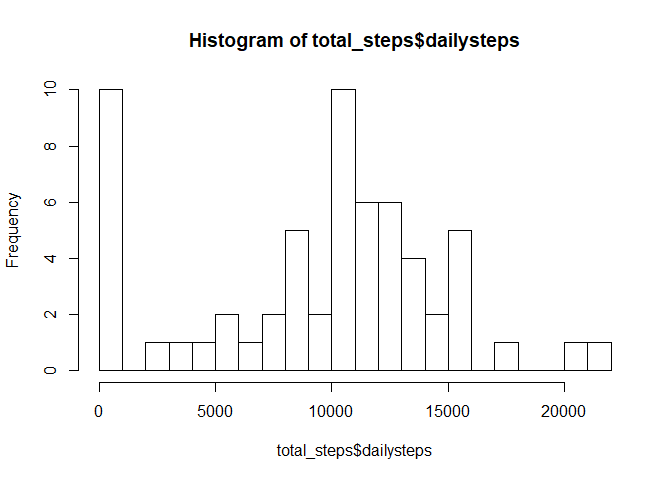
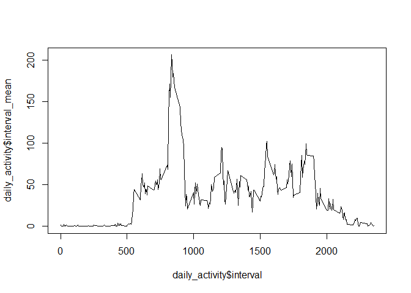
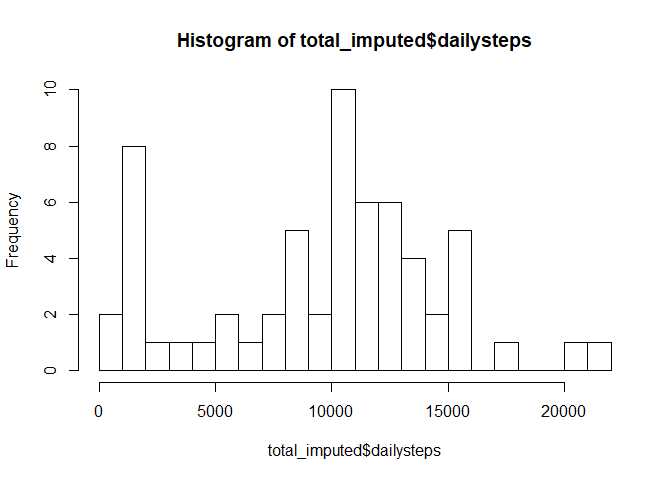
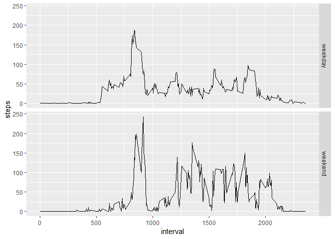

## Loading packages

```r
library(lubridate)
library(tidyverse)
```

## Loading and preprocessing the data

Loading the data which is stored in a .csv file. The date variable is read as a factor variable, so I use the as_date function from the lubridate package to recast the variable as a date variable.

```r
data <- read.csv('activity.csv')
data$date <- as_date(data$date)
```

## What is mean total number of steps taken per day?
First i calculate the total number of steps taken per day, and then I take the mean of the total numbers. NA's are removed when summarizing. 

```r
total_steps <- data %>% 
  group_by(date) %>%
  summarize(dailysteps = sum(steps, na.rm = TRUE))

hist(total_steps$dailysteps, breaks = 20)
```

<!-- -->

```r
mean(total_steps$dailysteps)
```

```
## [1] 9354.23
```

```r
median(total_steps$dailysteps)
```

```
## [1] 10395
```

The average total number of daily steps is 9354. The median is 10395 steps. The histogram shows that the most frequent number of daily steps are less than 1000 or between 10000 and 11000.

## What is the average daily activity pattern?
First I will calculate the mean activity for each time interval across the period in the dataset. This is stored in a new data frame named daily_activity.

```r
daily_activity <- data %>%
  group_by(interval) %>%
  summarize(interval_mean = mean(steps, na.rm = TRUE))
```

By plotting the mean number of steps for each interval against the interval we see the average daily activity.


```r
plot(daily_activity$interval, daily_activity$interval_mean, type = "l")
```

<!-- -->

The graph shows that there is basically no activity from midnight until 5 am. There is a peak in the average steps taken at around 9 am. There are also three smaller peaks at around noon, 4 pm and 7 pm. 

The interval with the highest number of average steps across all days is:

```r
daily_activity[which.max(daily_activity$interval_mean),]
```

```
## # A tibble: 1 x 2
##   interval interval_mean
##      <int>         <dbl>
## 1      835          206.
```

Between 08:30 and 08:35 the average number of steps is 206, which is the highest average number for any of the 5-minute intervals throughout the day.

## Imputing missing values
The total number of missing ("NA") values in the dataset is: 


```r
naCount <- sum(is.na(data$steps))
naCount
```

```
## [1] 2304
```

```r
naCount/nrow(data)*100
```

```
## [1] 13.11475
```

There are 2304 missing values in the dataset which account for 13% of the dataset.
I will impute the missing values by replacing them with the median of each interval.


```r
imputed_data <- data %>% 
  group_by(interval) %>%
  mutate_at(vars(steps), funs(ifelse(is.na(.),median(., na.rm = TRUE),.)))

total_imputed <- imputed_data %>% 
  group_by(date) %>%
  summarize(dailysteps = sum(steps))

hist(total_imputed$dailysteps, breaks = 20)
```

<!-- -->

```r
mean(total_imputed$dailysteps)
```

```
## [1] 9503.869
```

```r
median(total_imputed$dailysteps)
```

```
## [1] 10395
```

The mean of the imputed dataset is slightly higher at 9504 steps compared to the original dataset with NA's removed (mean = 9354). The median is identical for the two datasets at 10395. 

## Are there differences in activity patterns between weekdays and weekends?
Using weekdays() to find which day of the week each date is. Then i set saturday (laurdag) and sunday (søndag) to be weekend and any other day to be a weekday (apollogies for not knowing how to switch lubridate to english).

```r
imputed_data$weekday <- weekdays(imputed_data$date)

imputed_data$week <- ifelse(imputed_data$weekday %in% c("laurdag","søndag"),"weekend", "weekday")
```

I then calculate the daily activity as above.

```r
week_activity <- imputed_data %>%
  group_by(week, interval) %>%
  summarize(steps = mean(steps)) # no need to remove na here as they are imputed.
```

Finaly I plot the average interval activity in a panel.


```r
p <- ggplot(week_activity, aes(interval, steps)) + 
  geom_line()

p + facet_grid(rows = vars(week))
```

<!-- -->

The plots indicate that during the weekend the activity is more distributed throughout the day, while during the weekdays this person is rushing to work!
